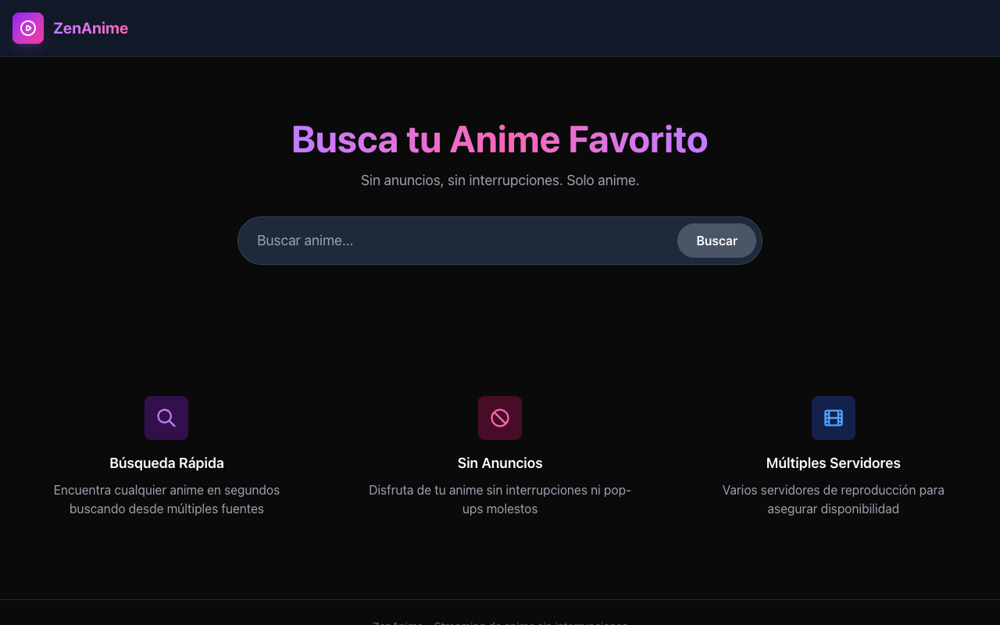

<p align="center">
  <b>⛩️ ZenAnime</b><br>
  <sub>Buscá y mirá anime sin publicidad — scraping server-side de múltiples fuentes.</sub>
</p>

<p align="center">
  
</p>

<p align="center">
  
  
  
  
</p>

---

## Qué hace

Web para buscar y reproducir anime sin publicidad. El servidor hace **scraping en vivo** de las fuentes (JKAnime y AnimeFLV) y consulta la API de **Jikan** (MyAnimeList) para los metadatos: sinopsis, puntaje, géneros, estudios y más.

## Funcionalidades

- **Búsqueda** de anime combinando múltiples fuentes (corrige typos con Jikan).
- **Detalle** del anime: sinopsis, puntaje, géneros y estudios.
- **Reproducción** de episodios con lista de capítulos.
- **Videos** extraídos por episodio.
- Scraping server-side con resolución de DNS y manejo de redirecciones propios.
- Cache en memoria para no repetir peticiones.

## Uso local

```bash
npm install
npm run dev      # http://localhost:3000
```

## Tecnologías

| Capa | Stack |
|------|-------|
| Framework | Next.js 16 (App Router) |
| UI | React 19 |
| Estilos | Tailwind CSS |
| Scraping | Cheerio + axios + `https`/`dns` de Node |
| Metadatos | Jikan API (MyAnimeList) |

---

> [!WARNING]
> **Solo uso educativo.** Este proyecto existe únicamente para aprender desarrollo web, scraping y APIs. No está afiliado ni respaldado por ningún sitio de streaming. Su uso puede violar los Términos de Servicio de sitios de terceros; el usuario es responsable de cumplir las leyes de su jurisdicción. No se recomienda usarlo para consumir contenido con derechos de autor.

---

<p align="center"><sub>Hecho con ❤️ por <a href="https://github.com/anthoniriv">Anthoni Rivera</a></sub></p>
